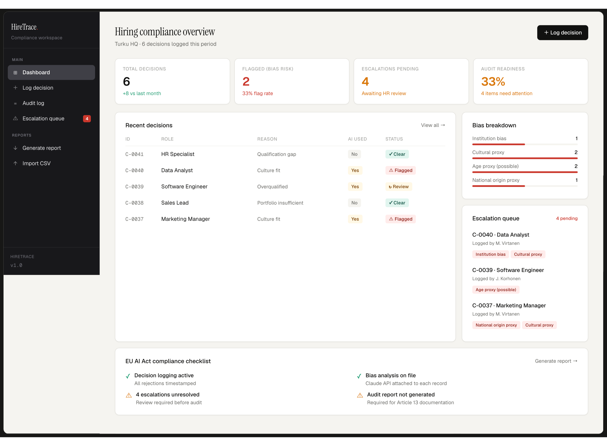
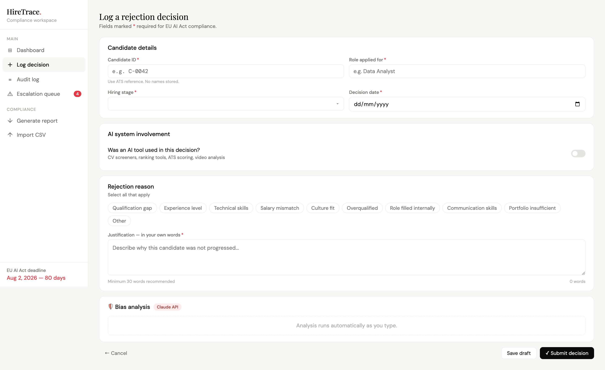
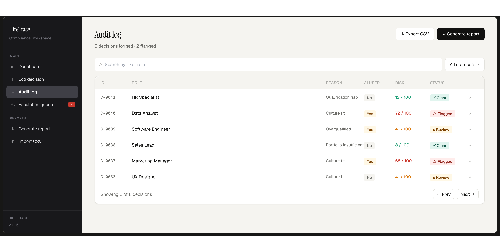
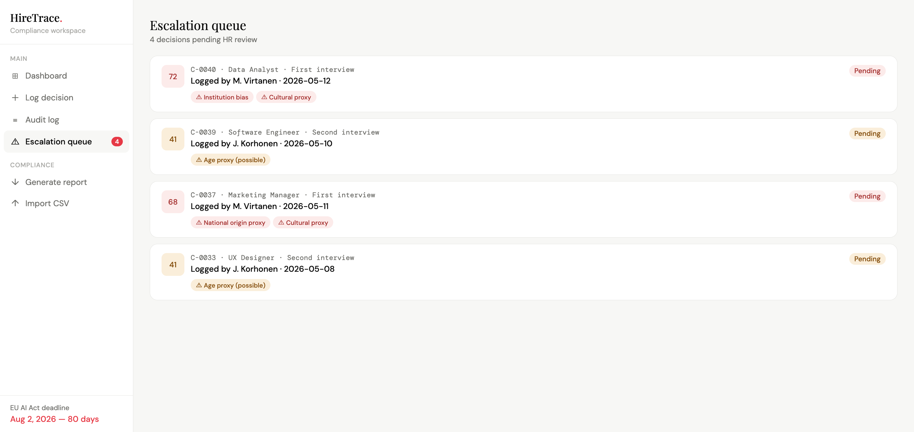
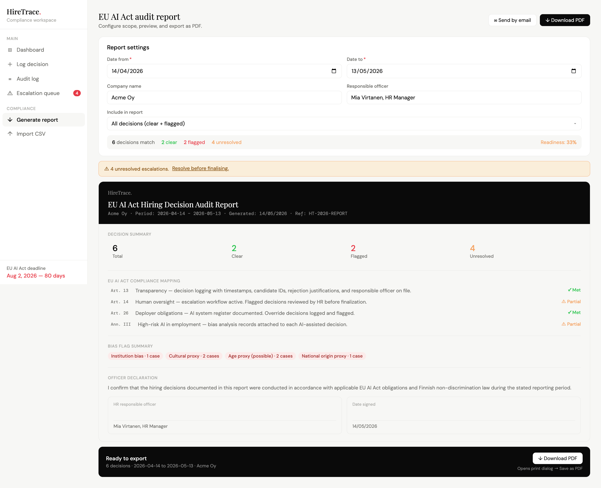
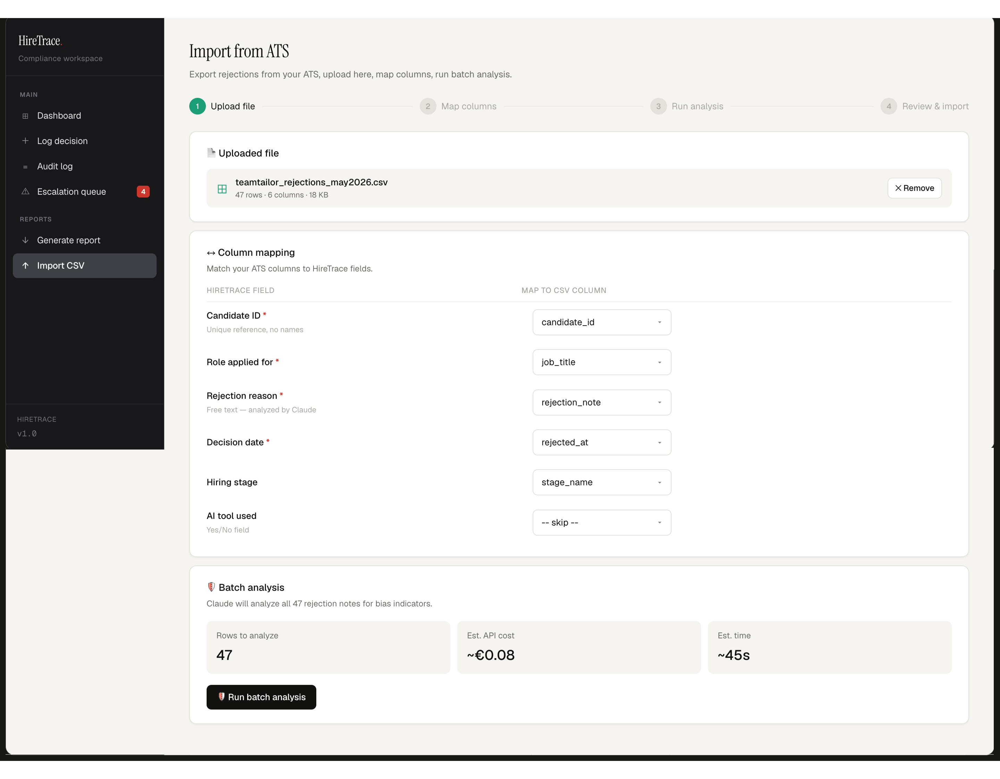

# HireTrace

**EU AI Act hiring decision compliance workspace**

HireTrace is a purpose-built compliance tool for HR teams operating under the [EU AI Act](https://eur-lex.europa.eu/legal-content/EN/TXT/?uri=CELEX:32024R1689), which classifies AI-assisted hiring as a **high-risk application** under Annex III. It provides structured decision logging, automated bias analysis, an HR escalation workflow, individual signed rejection records, and audit-ready PDF reporting — all in a single React component with no backend required.

**Enforcement deadline: 02 December 2027** (Annex III stand-alone systems, per the EU AI Act Omnibus amendment).

---

## What problem does it solve

The EU AI Act requires organisations using AI in hiring to:

- Maintain timestamped logs of every AI-assisted rejection decision with justifications (Article 13)
- Ensure meaningful human oversight and document manager overrides (Article 14)
- Register AI systems used in employment decisions (Article 26)
- Attach bias analysis records to each AI-assisted decision (Annex III)

Most Finnish HR teams have no tooling for this. Rejection decisions are logged in ATS free-text fields, bias review is informal or absent, and audit documentation is assembled manually under time pressure. Nobody audits the human manager who overrides the algorithm — which is the actual legal exposure point for deployers.

HireTrace is a working prototype of what purpose-built compliance tooling looks like.

---

## Features

### Dashboard
Real-time overview of the current compliance posture:
- Total decisions, flag rate, escalations pending, audit readiness percentage
- Bias breakdown chart with frequency bars per bias type
- Escalation queue preview showing top pending items with bias flags
- EU AI Act compliance checklist with live status across 4 obligations

### Log Decision
Structured form for logging a single rejection decision:
- Candidate ATS reference ID (no personal names stored)
- Role, hiring stage, decision date
- AI system involvement toggle — captures system name, AI recommendation, and manager override
- Rejection reason chips (multi-select)
- Free-text justification field
- **Live bias analysis panel** — fires automatically as the manager types, powered by the Claude API, returns flagged bias indicators with a risk score (0–100). Decisions scoring 60 or above are automatically routed to the escalation queue.

### Audit Log
Searchable, filterable table of all logged decisions:
- Filter by status (Clear / Flagged / In Review) or free-text search by ID or role
- Expand any row to see full justification, bias indicators, hiring stage, logged-by, and AI override note
- **↓ Download record** per decision — generates a fully formatted individual rejection record PDF with officer declaration and signature block

### Escalation Queue
HR reviewer workflow for all flagged and in-review decisions:
- Risk score badge (red = high risk, amber = medium risk)
- Expand to see justification text and Claude bias analysis detail
- Four resolution options: Justified / Partially justified / Not justified / Escalate to legal
- Reviewer notes appended to the audit record
- **✓ Resolve and download record** — resolves the case and simultaneously generates a signed individual PDF record including the reviewer decision and notes
- Unresolved escalations block audit report generation (Article 14 compliance)

### Generate Report
Bulk audit report with live preview and PDF export:
- Date range filter, company name, responsible officer configuration
- Live summary: matching decision count, clear/flagged/unresolved breakdown
- Unresolved escalation warning
- **↓ Download PDF** — generates a multi-section compliance report including cover block, decision summary stats, EU AI Act article compliance mapping (Art. 13, 14, 26, Ann. III), bias flag summary, and officer declaration with signature fields

### Import CSV
4-step wizard for batch importing rejections from an ATS export:
1. Upload — accepts CSV export from any ATS (Teamtailor, Recruitee, Workable, etc.)
2. Map columns — match ATS field names to HireTrace compliance fields
3. Run analysis — Claude API processes all rejection notes in batch for bias indicators
4. Review and import — clear/flagged counts, row preview, flagged decisions enter the escalation queue on import

---

## Individual rejection record PDF

Each decision can generate a standalone signed compliance record containing:

- Full decision details (candidate ID, role, stage, date, reason, risk score)
- Original rejection justification text
- Bias analysis results (flags detected by Claude API)
- HR reviewer decision and notes (when resolved via escalation queue)
- Officer declaration with signature block
- Article 13 and Annex III compliance statement
- HireTrace reference number and generation date

This record is generated as a print-formatted HTML file that auto-triggers the browser print dialog — save as PDF from there. No external PDF library dependencies in the browser.

---

## Tech stack

| Layer | Choice |
|---|---|
| Framework | React 18 (functional components, hooks) |
| Build tool | Vite 5 |
| Styling | Inline styles with a single design token object |
| State | useState / useRef — no external store |
| Fonts | Instrument Serif, Geist, Geist Mono (Google Fonts) |
| PDF | Browser window.print() with print-formatted HTML |
| Bias analysis | Claude API (simulated in prototype; prompt structure implied by UI) |
| Data | In-memory sample data (6 decisions) — no backend |

---

## Design system

All colours, spacing, and typography are defined in a single token object:

```js
const T = {
  black: "#111110",
  pageBg: "#F5F4F1",
  sidebarBg: "#18181B",
  red: "#C9372C",     redBg: "#FFECEB",   redText: "#8C1B13",
  amber: "#D97706",   amberBg: "#FFF8E6", amberText: "#7A4100",
  green: "#1D9E75",   greenBg: "#E1F5EE", greenText: "#085041",
  // ...
};
```

**Typefaces:**
- `Instrument Serif` — page headings and report titles
- `Geist` — all body text, UI labels, buttons
- `Geist Mono` — candidate IDs, risk scores, monospace data

**Sidebar:** Dark (`#18181B`) with light text — creates clear visual separation between navigation and content.

---

## Sample data

Six decisions are seeded on load to demonstrate all status states:

| ID | Role | Status | Risk | Bias flags |
|---|---|---|---|---|
| C-0041 | HR Specialist | Clear | 12 | — |
| C-0040 | Data Analyst | Flagged | 72 | Institution bias, Cultural proxy |
| C-0039 | Software Engineer | In Review | 41 | Age proxy (possible) |
| C-0038 | Sales Lead | Clear | 8 | — |
| C-0037 | Marketing Manager | Flagged | 68 | National origin proxy, Cultural proxy |
| C-0033 | UX Designer | In Review | 41 | Age proxy (possible) |

The flagged cases are intentionally realistic — justification text referencing "wrong university background", "accent was difficult to understand", and "seemed set in their ways" are the kinds of phrases that appear in real ATS rejection notes and carry real legal risk under Finnish non-discrimination law (Yhdenvertaisuuslaki 1325/2014).

---

## Running locally

```bash
git clone https://github.com/ashikdip/hiretrace.git
cd hiretrace
npm install
npm run dev
```

Open `http://localhost:5173`.

The entry point is `src/App.jsx`. `src/main.jsx` imports from there. No additional configuration required.

---

## EU AI Act compliance mapping

| Obligation | HireTrace feature |
|---|---|
| Art. 13 — Transparency | Timestamped decision log with candidate IDs, justifications, and responsible officer |
| Art. 14 — Human oversight | Escalation queue with reviewer decision, notes, and resolution workflow |
| Art. 26 — Deployer obligations | AI system name, recommendation, and override captured per decision |
| Annex III — High-risk AI | Bias analysis record attached to every AI-assisted rejection |

**Enforcement deadline:** 02 December 2027 for Annex III stand-alone systems (updated per EU AI Act Omnibus provisional agreement, May 2026).

---

## What this is not

HireTrace is a **prototype**, built to demonstrate what EU AI Act compliance tooling for hiring looks like in practice. It is not:

- A production-ready system
- Connected to a real database or authentication layer
- Running actual Claude API calls (bias analysis is simulated in the prototype)
- Legal advice

A production deployment would require: persistent storage, real authentication, live Claude API integration, email delivery, ATS API integrations, and an immutable audit trail.

---

## Context

Built in Turku, Finland. Finnish companies using AI-assisted hiring tools (Teamtailor, Recruitee, LinkedIn Recruiter, and others) will be subject to Annex III obligations by December 2027. HireTrace is the only purpose-built compliance workspace targeting this market.

**The gap:** ATS vendors log decisions but do not audit the human who overrides the algorithm. Generic GRC platforms handle compliance frameworks but lack HR-specific workflows. HireTrace fills both gaps in one tool.

---

## Screenshots

### Dashboard


### Log Decision


### Audit Log


### Escalation Queue


### Generate Report


### Import CSV


---

## Version

`v1.0` — May 2026

---

## License

MIT
